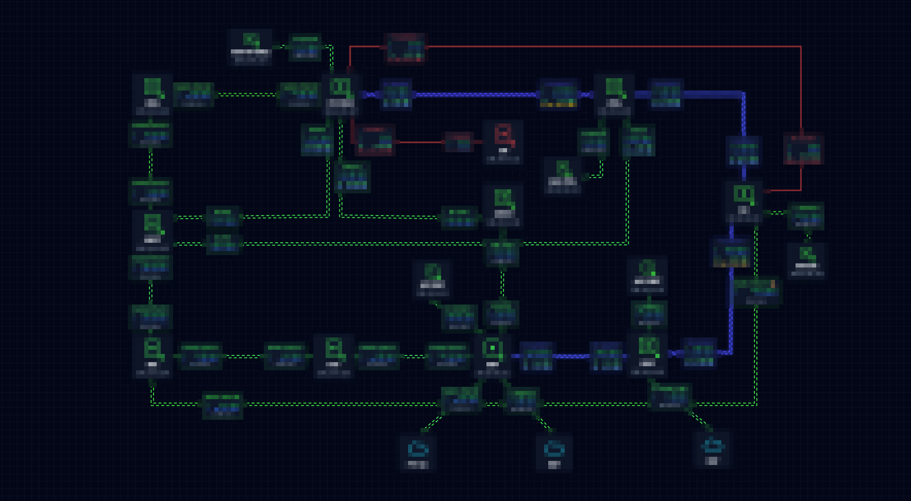
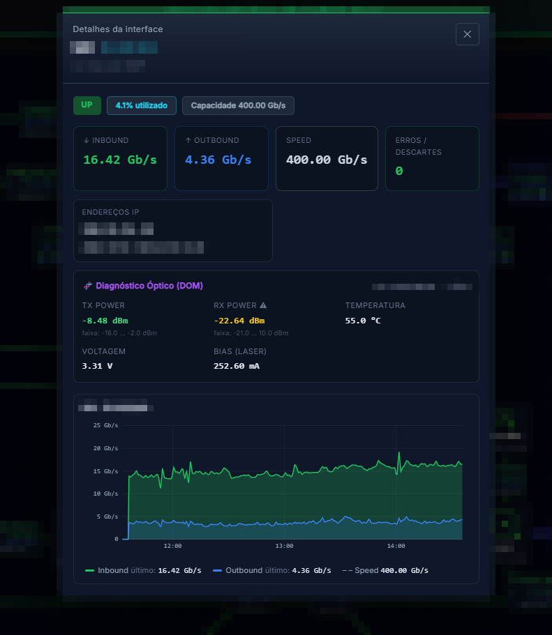
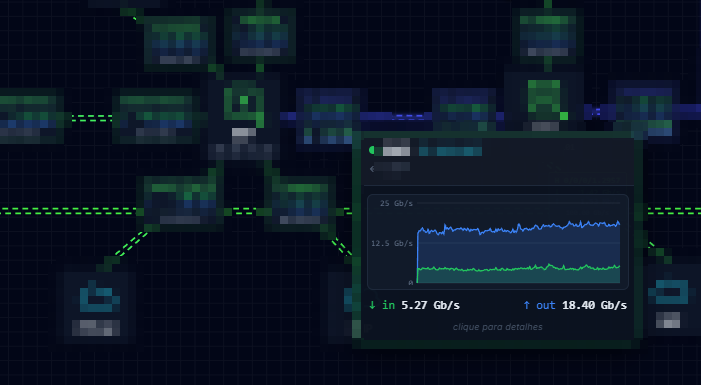
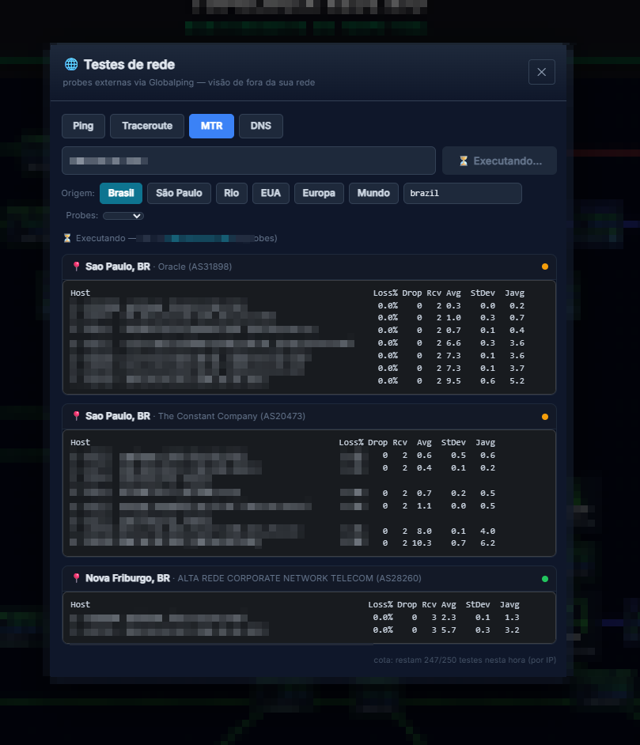

# Network Topology — painel de topologia de rede para Grafana

Mapa de rede editável para dashboards de NOC/ISP: nós = equipamentos, arestas =
links, com **binding dinâmico** a métricas do Zabbix/Prometheus. Pensado pra TV
de NOC — status ao vivo, tráfego in/out por interface, diagnóstico óptico (DOM),
limiares reais da interface, e testes de rede externos (Globalping).



*Mapa real em produção — identificadores borrados por privacidade.*

## Recursos

- **Editor draw.io-like**: arrasta nós, conecta com âncoras livres, rotas manuais (waypoints, ortogonal, curva), cards de interface arrastáveis.
- **Binding a métricas**: tráfego in/out, capacidade, status (ping/ifOperStatus), erros/descartes, IP (v4+v6), fibra DOM (Tx/Rx/temp/volt/bias) — com **⚡ auto-preenchimento** que detecta host/interface das séries do datasource.
- **Limiares ópticos reais**: potência avaliada contra os limites de Alarm/Warning da própria interface (verde/amarelo/vermelho) + info do módulo (modelo/serial/media type).
- **Leitura de NOC**: nó down apaga os links ao redor, congestionamento >90% vira laranja, thresholds estilo Flowcharting (cor + animação + traçado por regra).
- **Modal por interface** no padrão time series do Grafana (crosshair, eixos redondos, legenda) e tooltip com mini-gráfico no hover.
- **Testes de rede** (ping/traceroute/MTR/DNS) a partir de probes externas via Globalping — botão direito no equipamento ou botão flutuante.
- **TV**: escala de fonte, auto-fit que preenche a tela, travar zoom/pan.

## Screenshots

| Modal da interface — DOM, limiares reais e histórico | Tooltip com mini-gráfico no hover |
|---|---|
|  |  |


*Testes de rede (ping/traceroute/MTR/DNS) direto do mapa, via probes externas do Globalping.*

## Instalação (3 passos)

> Plugin **não assinado** — precisa ser liberado explicitamente. Uso interno.

1. **Copie os arquivos** pra pasta de plugins do Grafana. Pegue o zip da
   [release](../../releases) (ou gere com `npm run package`) e extraia:

   ```bash
   # o zip já traz a pasta grafana-network-topology/
   unzip grafana-network-topology-*.zip -d /var/lib/grafana/plugins/
   chown -R grafana:grafana /var/lib/grafana/plugins/grafana-network-topology
   ```

2. **Libere o plugin não assinado** — variável de ambiente OU grafana.ini:

   ```bash
   # env (Docker/systemd) — some com os outros unsigned se ja existirem: use virgula
   GF_PLUGINS_ALLOW_LOADING_UNSIGNED_PLUGINS=grafana-network-topology
   ```
   ```ini
   # OU em /etc/grafana/grafana.ini, secao [plugins]
   allow_loading_unsigned_plugins = grafana-network-topology
   ```

3. **Reinicie o Grafana** e dê hard refresh no navegador (Ctrl+Shift+R):

   ```bash
   systemctl restart grafana-server
   ```

Pronto: **Add panel → Network Topology**. Guia detalhado (troubleshooting,
Docker, CSP para os testes de rede, migração de mapa) em [INSTALL.md](INSTALL.md).

## Build a partir do código

```bash
npm install
npm run build        # gera dist/
npm run package      # gera dist-zip/grafana-network-topology-<versão>.zip
```

Requer Node 18+. O build roda `tsc --noEmit` antes do webpack — erro de tipo
falha o build.

## Licença

[Apache 2.0](LICENSE). Sem afiliação com Grafana Labs.
